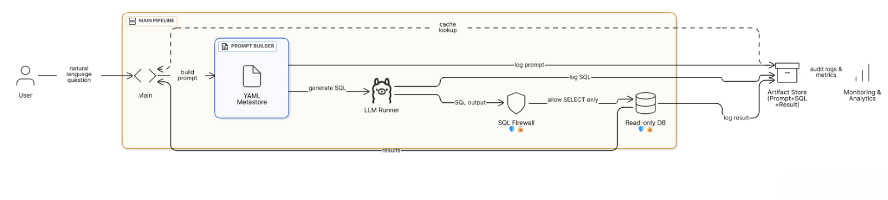
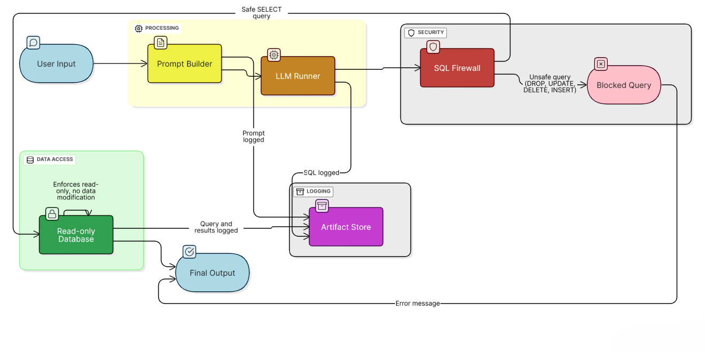
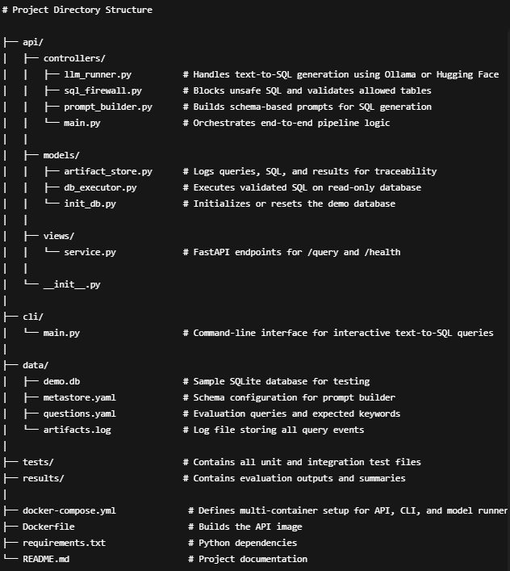

# How to Build a Private Text-to-SQL Service with Docker and LLM model runner

A containerized approach to natural language database queries with built-in safety and auditability

---

## Highlights  

- Fully containerized setup using Docker Desktop  
- One-click start through the Docker Desktop interface  
- SQL Firewall ensures only safe `SELECT` queries are executed  
- Full audit logging for every question, SQL, and result  
- Works offline after the model is downloaded once  

---

## Overview  

Accessing databases can be intimidating for non-technical users. This project bridges that gap by translating plain English questions into SQL queries while maintaining safety, transparency, and reproducibility.  

Built entirely with Docker, it includes separate containers for the API, model runner, and CLI — all working together to deliver accurate, read-only data insights. Whether you are a developer, analyst, or researcher, you can query data without writing a single line of SQL or risking data loss.  

---

## Architecture  

**Figure 1 — System Architecture:** Overview of modular components including the API, model runner, SQL firewall, and artifact store, all containerized and orchestrated through Docker Desktop.


- **API Service**: Receives natural language questions and coordinates the pipeline.  
- **Model Runner**: Runs the Mistral model (`ollama/ollama:latest`) in isolation.  
- **SQL Firewall**: Filters and validates SQL queries to block unsafe commands.  
- **Database Executor**: Executes only approved read-only SQL queries.  
- **Artifact Store**: Logs all inputs, outputs, and system actions.  

---

## Prerequisite  

To recreate this project, install **Docker Desktop** on your machine. No additional setup is required.  

---

## Setup and Execution  

### Run the Full Experiment

To launch the complete stack including the API and model runner, open Docker Desktop and start the project stack.  
This can also be done through the terminal by running:

```bash
docker-compose up --build
```

This builds and runs all containers in sequence.The model runner loads the `mistral:latest` model, verifies its health, and then starts the FastAPI service.  

When the run is complete, shut everything down with:

```bash
docker compose down
```
### Run Only the Interactive API

If you want to test queries through **Swagger UI** or **Thunder Client**, start only the API container.  
It automatically connects to the model runner and exposes endpoints locally.  
Once running, open your browser and visit:

```bash
docker-compose up  - -build api
```
**http://localhost:8000/docs**

### Run Only the CLI

For users who prefer working directly in the terminal, the **CLI** offers a clean interface for querying the database.  
First, build the CLI container using above
To open and interact with it directly in the terminal, use:

```bash
docker compose run --rm cli
```
                   
---

## How It Works

**Figure 2 — Query Workflow:** End-to-end process showing how user input passes through prompt building, SQL generation, validation, execution, and logging before returning results.


- The system converts plain English questions into SQL in five clear steps.  
- The prompt builder shapes the query context using the database schema.  
- The model runner generates candidate SQL statements, which are screened by the SQL firewall.  
- Only safe `SELECT` queries are executed on the read-only database.  
- All actions are logged by the artifact store for full traceability.

---

## Docker Model Runner

- The model runner handles all language model operations inside its own container using the `ollama/ollama` image.  
- Once visible in Docker Desktop, pressing **Play** starts the model automatically.  
- The first run downloads `mistral:latest` into a persistent volume, reused in every session.  
- The API connects locally through `OLLAMA_HOST`, keeping performance consistent and setup minimal.  
- After the initial download, the system runs fully offline.

---

## Command Line Interface (CLI)

The CLI offers a terminal-based way to run queries without the browser. It connects to the API and model runner, translating natural language into SQL and displaying clean results instantly.

Every CLI query is logged alongside API activity, maintaining a single audit record. It’s quick, local, and ideal for exploring how different questions are handled.

---

## Project Structure


**Figure 3 — Repository Tree:** Organized directory structure highlighting separation of API, CLI, data, tests, and configuration files for maintainability and clarity.


- Code, data, and configuration files are organized for clarity and easy maintenance.  
- Each service—API, model runner, data, and tests—has its own folder.  
- By being modular in design it helps to keep the project simple to navigate and extend for further cases.

---

## Output Artifacts

Running the full setup produces key outputs:  
- `demo.db`: the read-only SQLite database  
- `artifacts.log`: full record of all queries and results  
- `detailed_results.csv` and `summary_results.csv`: performance reports  
These files help verify accuracy, safety, and consistency across runs.

---

## Results and Evaluation

- Models were tested for accuracy and latency.  
- All delivered strong results, with **Llama** balancing both speed and precision.  
- Unsafe commands were consistently blocked, confirming that validation works as intended.  
- The system proved both reliable and secure in real-world use.

---

## Next Steps

Planned improvements include:  
- Smarter caching for repeated queries  
- Execution-based accuracy checks  
- PostgreSQL and MySQL support  
- Natural language summaries for query results  


---

## Contributing

Contributions are welcome. Open an issue, suggest features, or submit pull requests.  
Please review existing discussions before proposing new ideas.

---

Developed by **Vishesh Sharma**.


---

## References

- [FastAPI Documentation](https://fastapi.tiangolo.com)  
- [Docker Documentation](https://docs.docker.com)  
- [Ollama Model Runner](https://docs.ollama.com)  
- [Hugging Face Inference API](https://huggingface.co/docs/api-inference)

---
